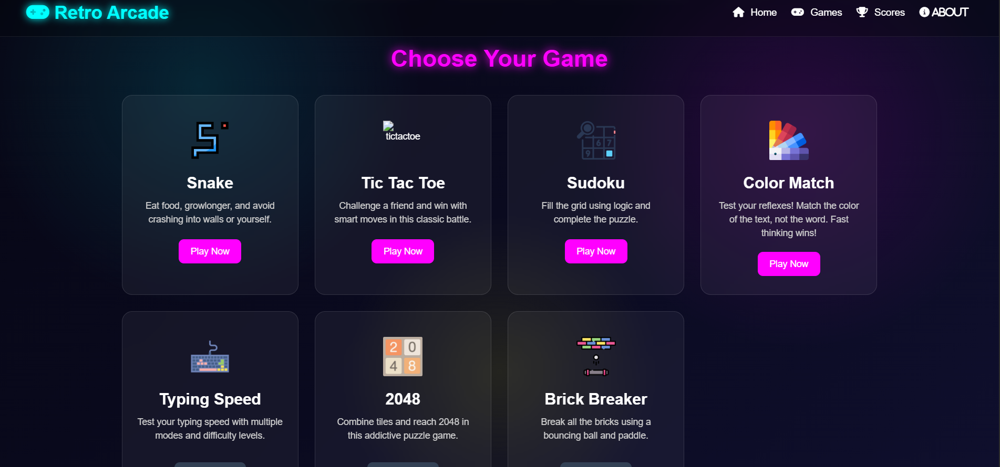
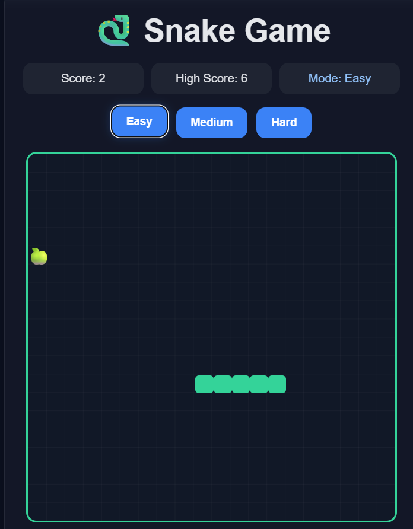
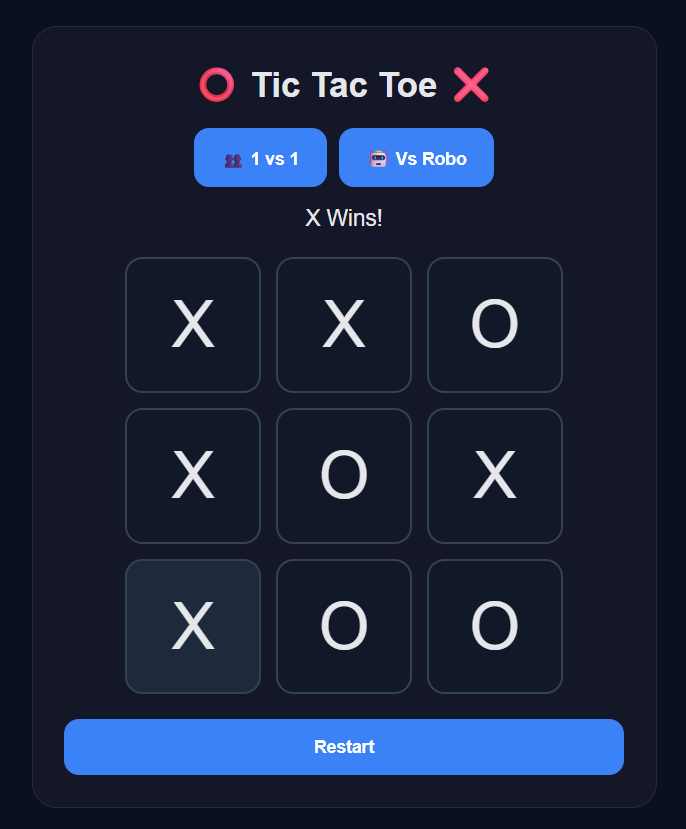
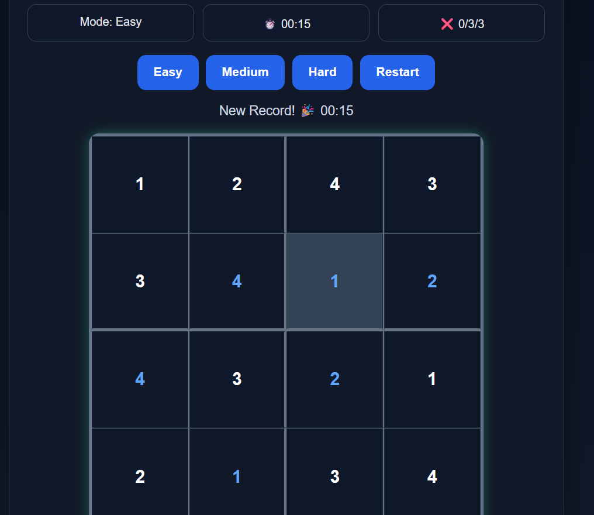
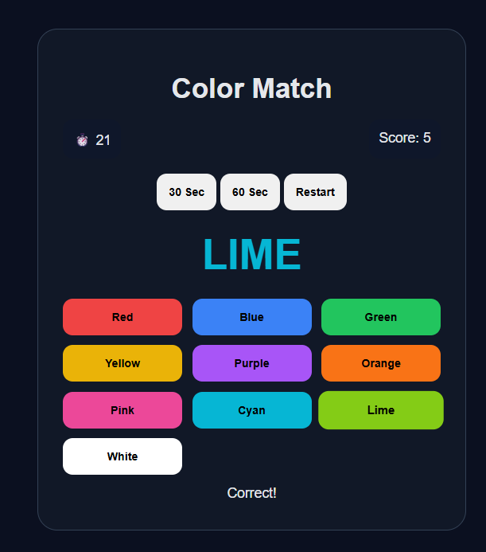

# 🎮 Retro Arcade

A sleek browser-based **mini arcade** built with pure HTML, CSS, and JavaScript.
Play multiple classic games in one place fast, responsive, and visually consistent.

---

## 🚀 Live Idea

> One platform. Multiple games. Endless fun.

---

## 🕹️ Games

### 🐍 Snake

- Difficulty modes (Easy/Medium/Hard)
- Score + High Score (local storage)
- Smooth controls + sound effects
- Use arrow keys for control

### ❌⭕ Tic Tac Toe

- 1v1 (Player vs Player)
- Player vs Robot 🤖
- Win / Draw detection

### 🎨 Color Match

- Reflex-based gameplay
- Match **text color**, not the word
- 30s / 60s modes
- Score system

### 🔢 Sudoku

- Easy (4×4), Medium & Hard (9×9)
- Random puzzle generation
- Timer + 3 mistake limit
- Auto validation + solution reveal

---

## 🧩 Coming Soon

- ⌨️ Typing Speed Test
- 🔢 2048
- 🧱 Brick Breaker

---

## 🗂️ Project Structure

```bash id="48219"
Retro-Arcade/
│
├── index.html
├── style.css
│
├── games/
│   ├── snake/
│   │   ├── snake.html
│   │   ├── snake.css
│   │   └── snake.js
│   │
│   ├── tictactoe/
│   │   ├── tictactoe.html
│   │   ├── tictactoe.css
│   │   └── tictactoe.js
│   │
│   ├── sudoku/
│   │   ├── sudoku.html
│   │   ├── sudoku.css
│   │   └── sudoku.js
│   │
│   ├── color/
│   │   ├── color.html
│   │   ├── color.css
│   │   └── color.js
│
└── assets/
```

---

## 🏆 Project Structure

- Scores are saved using localStorage and displayed on the home screen.

---

## ✨ Highlights

- 🎨 Consistent dark arcade UI
- ⚡ Fast, lightweight (no frameworks)
- 📱 Responsive design
- 🔊 Sound feedback for interactions
- 💾 Local storage for scores & stats

---

## 🛠️ Tech

- HTML5
- CSS3
- JavaScript (Vanilla)

---

## 📸 Screenshots

### 🏠 Home Page



### 🐍 Snake Game



### Tictactoe Game



### 🧩 Sudoku



### 🎨 Color Match



## ▶️ Run Locally

```
open index.html
```

(No setup, no installs just open and play)

---

## 🎯 Goal

Build a **multi-game arcade experience** while learning:

- Game logic
- UI/UX design
- JavaScript fundamentals

---

## 👩‍💻 Author

**AVA**

---

## ⭐

If you like this project, drop a ⭐ it helps!
